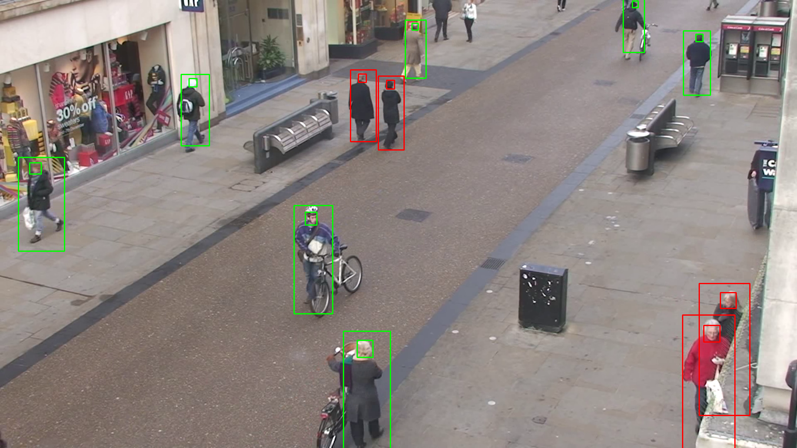
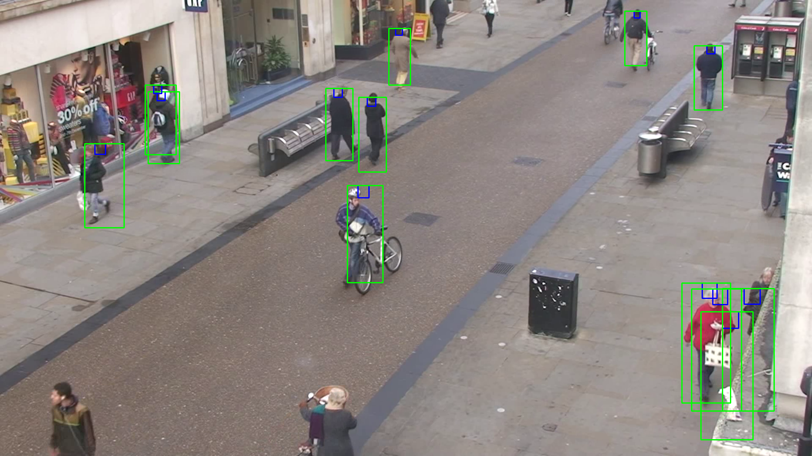
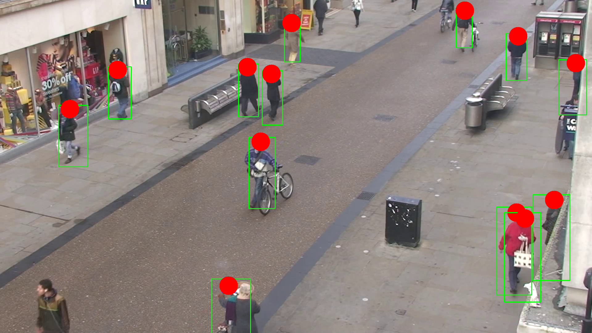
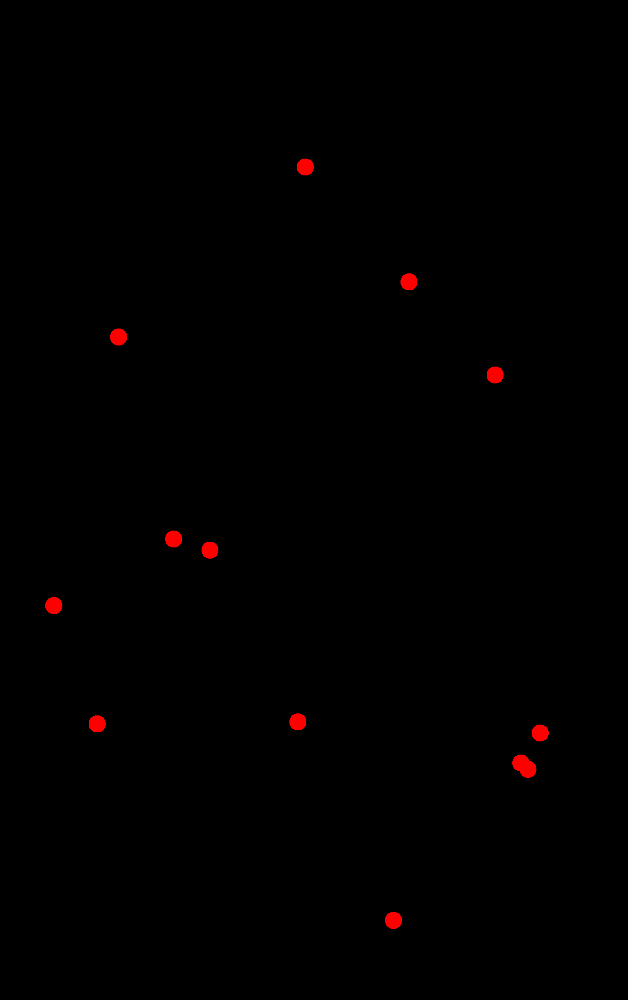
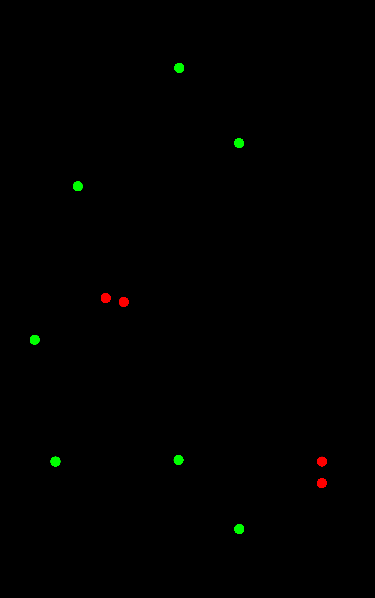

# DETECTOR DISTANCIA SOCIAL

## Datos del curso 📘

Proyecto parcial
**Curso: Computación Gráfica**
**Clase del 2020-1**
**Maestría en informática - Mención en ciencias de la computación**

## Objetivo 🎯

El proyecto tiene como objetivo desarrollar una pieza de código capaz de recibir como entrada un video de una calle concurrida en Londres y determinar que personas mostradas en el video cumplen con una normativa de distancia social y cuales no. El video usado se puede encontrar en el siguiente [enlace](http://www.robots.ox.ac.uk/ActiveVision/Research/Projects/2009bbenfold_headpose/Datasets/TownCentreXVID.avi), el cual es material para el desarrollo de algoritmos de detección en imagenes proporcionado por la universidad de Oxford. Por otro lado, tambien se utiliza la información de los puntos que determinan los bounding boxes correspondientes a los cuerpos y cabezas de los transeuntes mostrados en el video anterior. Esta información puede ser encontrada en el siguiente [enlace](http://www.robots.ox.ac.uk/ActiveVision/Research/Projects/2009bbenfold_headpose/Datasets/TownCentre-groundtruth.top)

Finalmente el resultado obtenido es un video compuesto de frames como el mostrado a continuación:

 
    

## Arquitectura y estructura de archivos 🏢

El proyecto cuentas con las siguientes carpetas:

📁 Archivos Setup ([Ver](/Archivos%20Setup)) .- Contiene los archivos para la configuración inicial del entorno para ejecutar los programas.

📁 Archivos Data ([Ver](/Data)) .- En esta carpeta se deben almacenar los archivos para la prueba que son tres: 
- El video donde se realizará la inspección (video.avi)
- Dos archivos que tiene la información de los bounding boxes (caminantes.csv y walkers.txt)

📁 Experimentos ([Ver](/Experimentos)) .- Contienen los experimentos hechos en jupyter notebooks donde se va probando cada una de las funciones creadas para el proyecto. Estos experimentos son listados a continuación:

- Experimento 1 ([Ver](/Experimentos/Experimento%201%20-%20Visualización%20del%20vídeo.%20Identificación%20de%20puntos.ipynb)): Visualización del video y marcado de bounding boxes en los frames.

 
    

- Experimento 2 ([Ver](/Experimentos/Experimento%202%20-%20Determinación%20de%20la%20tranformación.ipynb)): Determinación de la matriz de transformación de la imagen y muestra de la imagen transformada.

 
    

- Experimento 3 ([Ver](/Experimentos/Experimento%203%20-%20Gráfica%20de%20puntos%20en%20ojo%20de%20halcon.ipynb)): Se grafican los puntos que representan las cabezas de las personas pero desde una vista denominada ojo de halcon.

 
    
    

- Experimento 4 ([Ver](/Experimentos/Experimento%204%20-%20Determinación%20de%20infractores.ipynb)): Determinación de infractores. En este experimento se muestran los infractores de color rojo y los que no en color verde. tanto en los frames del video como en la vista de ojo de hálcon.

 
    
    

- Experimento 5: 

📁 Resultados [Ver] .-

## Configuración 

## Autor 💻

 
    

* **Juan Manuel Mendoza Jacinto** - [Linkedin](https://pe.linkedin.com/in/juan-manuel-mendoza-jacinto-18515ab0) - [Github](https://github.com/fararay)

## Licencia 📄

La licencia de este proyecto es del tipo **GNU General Public License v3.0** ([Ver](LICENSE.md))

