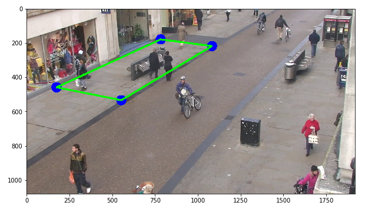

# DETECTOR DISTANCIA SOCIAL

## Datos del curso 📘

 **Proyecto parcial**
* **Curso: Computación Gráfica**
* **Clase del 2020-1**
* **Maestría en informática - Mención en ciencias de la computación**

## Objetivo 🎯

El proyecto tiene como objetivo desarrollar una pieza de código capaz de recibir como entrada un video de una calle concurrida en Londres y determinar que personas mostradas en el video cumplen con una normativa de distancia social y cuales no. El video usado se puede encontrar en el siguiente [enlace](http://www.robots.ox.ac.uk/ActiveVision/Research/Projects/2009bbenfold_headpose/Datasets/TownCentreXVID.avi), el cual es material para el desarrollo de algoritmos de detección en imagenes proporcionado por la universidad de Oxford. Por otro lado, tambien se utiliza la información de los puntos que determinan los bounding boxes correspondientes a los cuerpos y cabezas de los transeuntes mostrados en el video anterior. Esta información puede ser encontrada en el siguiente [enlace](http://www.robots.ox.ac.uk/ActiveVision/Research/Projects/2009bbenfold_headpose/Datasets/TownCentre-groundtruth.top)

Finalmente el resultado obtenido es un video compuesto de frames como el mostrado a continuación:

 
    

## Arquitectura y estructura de archivos 🏢

El proyecto cuentas con las siguientes carpetas:

📁 Setup ([Ver](/Archivos%20Setup)) .- Contiene los archivos para la configuración inicial del entorno para ejecutar los programas.

📁 Data ([Ver](/Data)) .- En esta carpeta se deben almacenar los archivos para la prueba que son tres: 
- El video donde se realizará la inspección (video.avi)
- Dos archivos que tiene la información de los bounding boxes (caminantes.csv y walkers.txt)

📁 Experimentos ([Ver](/Experimentos)) .- Contienen los experimentos hechos en jupyter notebooks donde se va probando cada una de las funciones creadas para el proyecto. Estos experimentos son listados a continuación:

- Experimento 1 ([Ver](/Experimentos/Experimento%201%20-%20Visualización%20del%20vídeo.%20Identificación%20de%20puntos.ipynb)): Visualización del video y marcado de bounding boxes en los frames.

 
    

- Experimento 2 ([Ver](/Experimentos/Experimento%202%20-%20Determinación%20de%20la%20tranformación.ipynb)): Determinación de la matriz de transformación de la imagen y muestra de la imagen transformada.

 
    

- Experimento 3 ([Ver](/Experimentos/Experimento%203%20-%20Gráfica%20de%20puntos%20en%20ojo%20de%20halcon.ipynb)): Se grafican los puntos que representan las cabezas de las personas pero desde una vista denominada ojo de halcon.

 
    
    

- Experimento 4 ([Ver](/Experimentos/Experimento%204%20-%20Determinación%20de%20infractores.ipynb)): Determinación de infractores. En este experimento se muestran los infractores de color rojo y los que no en color verde. tanto en los frames del video como en la vista de ojo de hálcon.

 
    
    

- Experimento 5:([Ver](/Experimentos/Experimento%205%20-%20Mejoras.ipynb)): En esta experiencia se añaden mejoras como la variación de la distancia permitida y el trazo de rectas de separación.

 
    

📁 Resultados ([Ver](/Resultados)) .- En esta carpeta se almacenan las imagenes que se obtuvieron como resultado de los experimentos.

## Pasos para ejecución (Colab, Jupyter Notebook) 📑

### Jupyter Notebook 

- Clonar el proyecto, usar:
`git clone https://github.com/fararay/DETECTOR_DISTANCIA_SOCIAL.git`
- Descargar los archivos del siguiente ([Enlace](/Experimentos/Experimento%205%20-%20Mejoras.ipynb)).
- Mover los archivos en la carpeta Data
- Ejecutar el cuaderno (Programa_Final.ipynb) 

### Colab

- Copiar el archivo (Programa_Final_(Colab).ipynb) a Google Drive
- Descargar los archivos del proyect,usar:
`!wget link1`
`!wget link2`
- Ejecutar el cuaderno 

## Algoritmo💡

#### El programa desarrollado sigue los siguientes pasos para poder determinar la vista bird-eye

- **División de los frames y trazado de bounding boxes** .- Se usa la librería opencv para poder dividir el video en frames y en base a la información del archivo de texto correspondiente se trazan los bounding boxes que envuelven a cada una de las personas en cada frame.
- **Determinación de la transformación** .- Realizado en el experimento 2. Se trata de corresponder puntos conocidos de un frame del video original con la forma a la que se quiere llegar finalmente. Este proceso genera una matriz de transformación la cual será usada posteriormente. Se aproxima la distancia en unidades reales en la segunda imagen según el código mostrado a continuación:
`#6 lozas de ancho - Aproximamos ancho de 40 cm`
`#15 Lozas de alto - Aproximamos largo de 40 cm`
`pix_unit = 1.7 #pixeles por centimetro`
`width_street = 240*pix_unit`
`height_street = 600*pix_unit`

 
    

- **Determinación de puntos representativos** .- Se usa la información de los puntos correspondientes a bounding boxes para determinar aproximadamente la posición de la cabeza de una persona en el frame original, asi mismo, se utiliza la matriz de transformación para ubicar esos puntos en la imagen resultado (bird-eye).
- **Determinación de puntos buenos y malos** .- En base a una distancia de restricción dada se determinan que puntos que representan a las personas cumplen con la restricción y cuales no, para ello se usa la posición de los puntos en la imagen bird-eye y se determina la distancia simple euclidiana entre ellos.
- **Visualización de resultados**.- En base a la información de los puntos buenos y malos, se marcan con color rojo aquellos que no cumplen la restricción de distancia en la imagen resultado. Asi mismo, los que si cumplen son mostrados en color verde. El conjunto de puntos buenos y malos tambien determinan el color de los bounding boxes que corresponden a las personas en la imagen original.

## Autor 💻

 
    

* **Juan Manuel Mendoza Jacinto** - [Linkedin](https://pe.linkedin.com/in/juan-manuel-mendoza-jacinto-18515ab0) - [Github](https://github.com/fararay)

## Licencia 📄

La licencia de este proyecto es del tipo **GNU General Public License v3.0** ([Ver](LICENSE.md))

